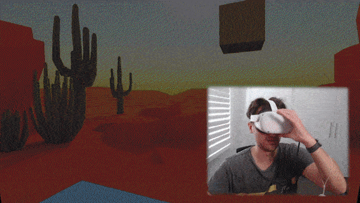

# Unity NFT Loot Boxes

Integrate web3 functionality into your VR games using [GamingKit](https://docs.web3sdks.com/gamingkit), including:

- Loading 3D asset NFTs
- Connecting to user wallets
- Viewing wallet balances

See the [live demo](https://unity-vr.web3sdks-template.com) or view the preview below:

;

## Using This Template

- Follow our guide to [Setting Up Unity](https://blog.web3sdks.com/guides/get-started-with-web3sdkss-unity-sdk/).

- Run the command below to clone this repository:

```bash
git clone https://github.com/web3sdks-template/unity-vr.git
```

- Select the `WebXRFullView2020` WebGL template when you build your project.

## How It Works

Below, we'll outline the key components of this template.

### Entering VR

As we are building our game for the web using the `WebXR` build templates, we can detect when a VR device is available and enter VR mode in the [index.html](./Assets/WebGLTemplates/WebXRFullView2020/index.html) file.

**Define the enterVRButton**

```html
<button id="entervr" value="Enter VR" disabled>VR</button>
```

**Detect when a VR device is available**

```js
let enterVRButton = document.getElementById("entervr");
document.addEventListener(
  "onVRSupportedCheck",
  function (event) {
    enterVRButton.disabled = !event.detail.supported;
  },
  false
);
```

**Enter VR mode**

```js
enterVRButton.addEventListener(
  "click",
  function (event) {
    try {
      unityInstance.Module.WebXR.toggleVR();
    } catch (e) {
      console.log(e);
    }
  },
  false
);
```

### Loading 3D Asset NFTs

In the [Web3.cs](./Assets/Scripts/Web3.cs) file we:

1.  [Instantiate the SDK](https://docs.web3sdks.com/gamingkit/setting-up/instantiating-the-sdk):

```csharp
using Web3sdks; // 1. Import the Web3sdksSDK

public class Web3 : MonoBehaviour
{
    // 2. Create a Web3sdksSDK instance for us to use throughout the class
    private Web3sdksSDK sdk;

    void Start()
    {
        // 3. When the app starts, set up the Web3sdksSDK
        sdk = new Web3sdksSDK("optimism-goerli");
    }
}
```

2. - [Connect to our smart contract](https://docs.web3sdks.com/gamingkit/interact-with-contracts/connect-to-a-contract) inside the `LoadNft` function. Once connected, we call the `ERC721.Get` method to load a specific NFT from our contract.

[View the smart contract](https://web3sdks.com/optimism-goerli/0xaca236B8569932eedBb2a5B958Ef22a81a6f768c/nfts)

```csharp
private string assetBundleUrl;

async Task<string> LoadNft()
{
    var contract =
        sdk.GetContract("0x5745Bd4F05B4c5786Db03be8Bd7982B30f495222");
    var nft = await contract.ERC721.Get("4");
    assetBundleUrl = nft.metadata.image;
    return assetBundleUrl;
}
```

The `metadata.image` of the NFT points to a [Unity AssetBundle](https://docs.unity3d.com/Manual/AssetBundlesIntro.html) that we can load into our game. The asset is a simple cube with a texture applied to it, which was uploaded to IPFS using our [Storage CLI](https://docs.web3sdks.com/storage).

The `assetBundleUrl` stores the URL of the asset bundle, which we can then load into our game.

### Rendering the NFT

Inside the `SpawnNft` function, we use the [UnityWebRequestAssetBundle](https://docs.unity3d.com/ScriptReference/Networking.UnityWebRequestAssetBundle.html) class to load the asset bundle from the URL we stored in the `assetBundleUrl` variable.

```csharp
IEnumerator SpawnNft()
{
    // 1. Get the asset bundle from the URL using a web request
    UnityWebRequest www =
        UnityWebRequestAssetBundle.GetAssetBundle(assetBundleUrl);
    yield return www.SendWebRequest();

    // 2. Instantiate the asset bundle into the scene.
    AssetBundle bundle = DownloadHandlerAssetBundle.GetContent(www);
    GameObject prefab = bundle.LoadAsset<GameObject>(assetName);
    GameObject instance =
        Instantiate(prefab, new Vector3(0, 3, 5), Quaternion.identity);
}
```

### Connecting User Wallets

The big connect wallet button in the scene listens for events when the player VR controllers come into contact with it inside the [ButtonContactDetector](./Assets/Scripts/ButtonContactDetector.cs) script.

```csharp
using Web3sdks;
using UnityEngine;

public class ButtonContactDetector : MonoBehaviour
{
    private Web3sdksSDK sdk;

    void Start()
    {
        sdk = new Web3sdksSDK("optimism-goerli");
    }

    // When the box collider comes into contact with the hands
    private async void OnTriggerEnter(Collider other)
    {
        // If the tag is player
        if (other.gameObject.tag == "Player")
        {
            string address =
                await sdk
                    .wallet
                    .Connect(new WalletConnection()
                    {
                        provider = WalletProvider.CoinbaseWallet,
                        chainId = 420 // Switch the wallet to Optimism Goerli on connection
                    });
        }
    }
}
```

## Questions?

Jump into our [Discord](https://discord.com/invite/web3sdks) to speak with the team directly!
